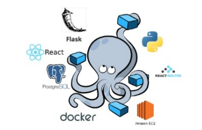

# Microservices-with-Docker-flask-and-react

Projet de creation d'un site web de gestion d'interactions utilisateurs (login , register , authentification , authorization , test unitaires , developpement et Integration continu , ...) et les operations CRUD sur base de données avec React et flask , tout ceci empaqueter dans des conteneurs Docker pour une meilleure autonomie et modelisé suivant une architecture microservice.

	
	
	
	
	
	
	
	

<h2>Table de matiere</h2>
<ol style = "list-type-style: squarre">
	<li><a href = "">Concept de microservices</a></li>
	<li><a href = "">Architecture du site</a></li>
	<li><a href = "">Differents microservices</a></li>
	<li><a href = "">Interface utilisateur</a></li>
	<li><a href = "">Installation et utilisation du projet</a></li>
  	<li><a href = "">Crédit </a></li>  
</ol>

  <h2 font-color = "red">Concept d'architecture microservice</h2>
	
L'architecture Microservices propose une solution en principe simple : découper une application en petits services, appelés Microservices, parfaitement autonomes, qui exposent une API REST que les autres microservices pourront consommer.  
	 
		Chaque microservice est parfaitement autonome : il a sa propre base de données, son propre serveur d'application (Tomcat, Jetty, etc.), ses propres librairies et ainsi de suite. La plupart du temps, ces microservices sont chacun dans un container Docker, ils sont donc totalement indépendants y compris vis-à-vis de la machine sur laquelle ils tournent.
	

  <h2 font-color = "red">Architecture du site</h2>
	
Le site web fonctionne suivant une architecture de microservices. C'est-à-dire que toutes les fonctionalités du systeme sont divisées en de petits microservices possedant chacun sa base de données , ses langages de programmations spécifiques, empaquetés dans des containeurs Docker et retournant une reponse sous format JSON qui sera integré à l'interface utilisateur. 
	Comme services , c'est un site web qui permet d'inscrire et/ou de connecter les utilisateurs aux fonctionnalité d'un système en passant par les tests d'interface, d'authentification , des integrations contitnues et la sauvegarde des information utilisateurs dans une base de données. A chaque fonctionnalités il existe un service specialisé. Chaque service est empaqueter sous Docker puis deployé avec <strong>Amazon EC2<strong>. 
		
	

	

  <h2 font-color = "red">Differents services</h2>
	

  <h2 font-color = "red">Interface utilisateur</h2>
	

  <h2 font-color = "red">Installation et utilisation du projet</h2>
	<h3><li>A partir de Docker</li> </h3>
	
Docker. Docker est un logiciel qui permet de créer et de gérer des conteneurs, qui sont des environnements isolés pour exécuter des applications. Pour installer Docker, vous devez suivre les étapes suivantes, selon votre système d’exploitation:

	<h3><li>Grace à l'environnement virtuel</li></h3> 

  <h2 font-color = "red">Credits</h2>
	<h3>Langages utilisés</h3>
	

		
  		
		
		
		
	

 <h3>Me contacter</h3>
 

	 
	 
	 
	 
 

	

